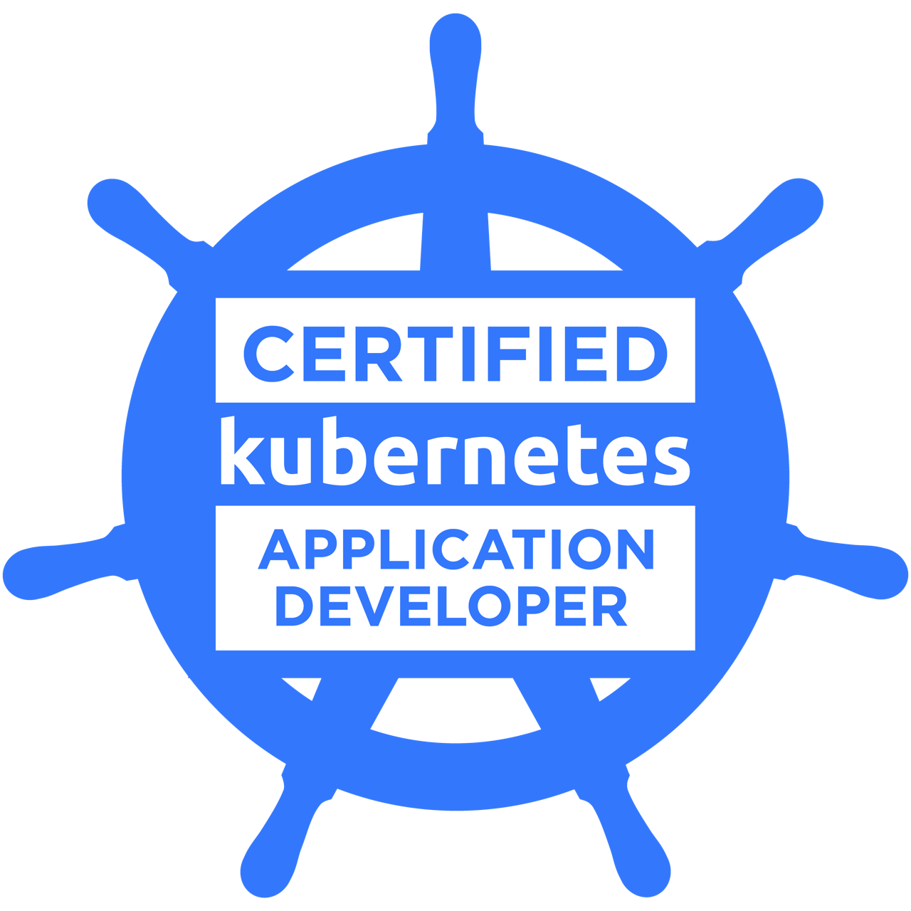

 
   

# 💫 I'm Shreyash Srivastava

- 🏅 **Certified Kubernetes Application Developer (CKAD)**
- 💻 **Backend Developer** @ Seeqlo (Aug - Feb)
- 🚀 **Full Stack Developer** @ Ignito Co. (July - Aug)
- 🌱 Interested in Backend development and Devops.
- 📫 How to reach me: **shreyash.sri09@gmail.com**

 

<h3 align="left">Connect with me:</h3>

  
  
  

 

## 💻 Tech Stack:

    
    

    
    

 

### 🏆 Badges:

  
  &nbsp;&nbsp;&nbsp;&nbsp;
  

 

  

